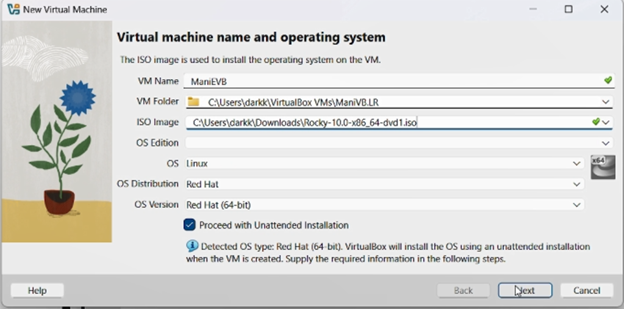
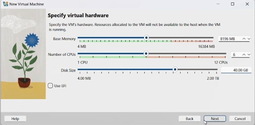
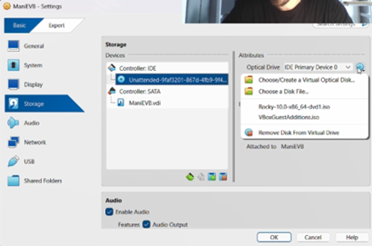
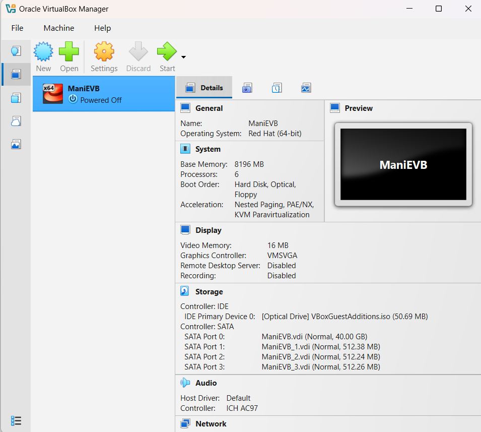
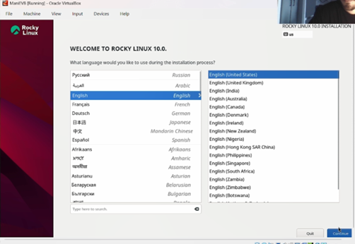
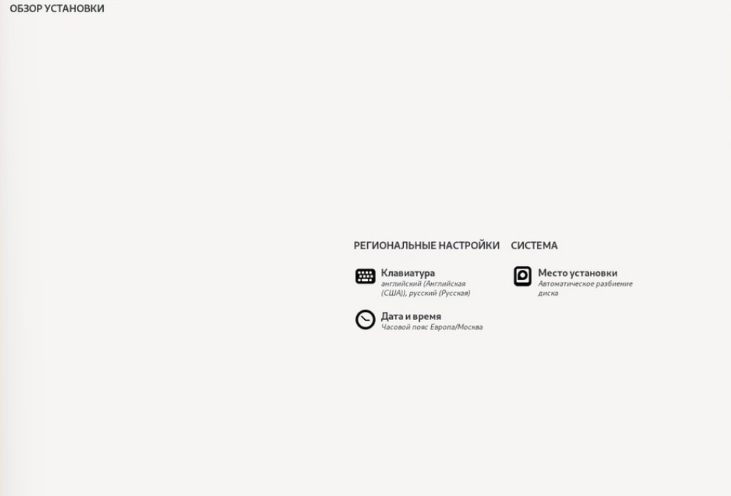
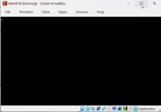
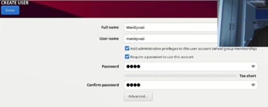
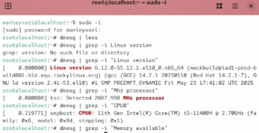
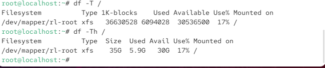

# Цели и задачи работы

## Цель лабораторной работы

Целью данной работы является приобретение практических навыков установки операционной системы на виртуальную машину и настройки минимально необходимых для дальнейшей работы сервисов.

\newpage

# Процесс выполнения лабораторной работы

## Создание виртуальной машины

Создаю виртуальную машину.

{ width=85% }

*Рис. 1 — Создание новой виртуальной машины*

\newpage

## Конфигурация жёсткого диска

Задаю конфигурацию жёсткого диска.

{ width=85% }

*Рис. 2 — Конфигурация жёсткого диска*

\newpage

## Конфигурация жёсткого диска (продолжение)

Задаю конфигурацию жёсткого диска.

{ width=85% }

*Рис. 3 — Конфигурация жёсткого диска*

\newpage

## Добавление образа системы

Добавляю новый привод оптических дисков и выбираю образ.

{ width=70% }

*Рис. 4 — Конфигурация системы*

\newpage

## Установка языка

Выбор языка системы.

{ width=85% }

*Рис. 5 — Установка языка*

\newpage

## Параметры установки

Настройка параметров установки.

{ width=85% }

*Рис. 6 — Параметры установки*

\newpage

## Процесс установки

Запуск и выполнение установки системы.

{ width=80% }

*Рис. 7 — Установка*

\newpage

## Создание пользователя

Создание пользователя системы.

{ width=85% }

*Рис. 8 — Создание пользователя*

\newpage

## Рабочая система

Проверка работы системы.

{ width=85% }

*Рис. 9 — Команда dmesg*

\newpage

## Рабочая система (продолжение)

Дополнительная проверка работы системы.

{ width=85% }

*Рис. 10 — Команда dmesg*

\newpage

# Выводы по проделанной работе

## Вывод

В ходе выполнения лабораторной работы были приобретены практические навыки установки операционной системы на виртуальную машину и настройки минимально необходимых для дальнейшей работы сервисов.