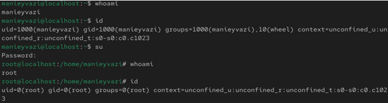
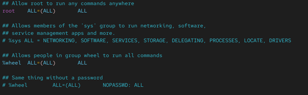
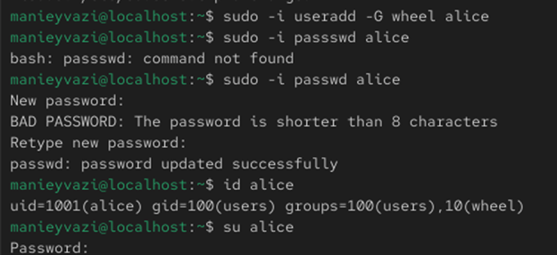
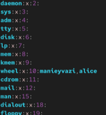
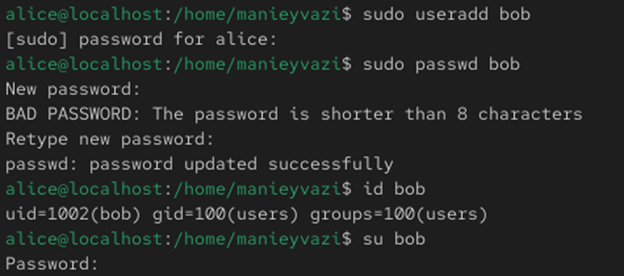
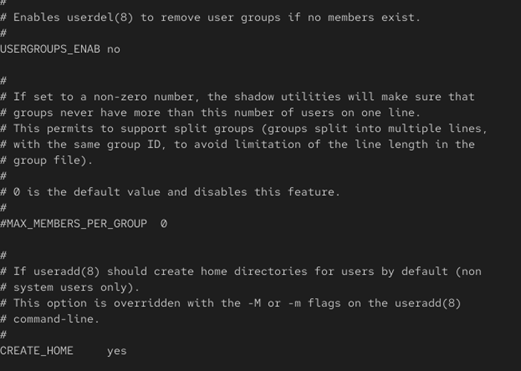
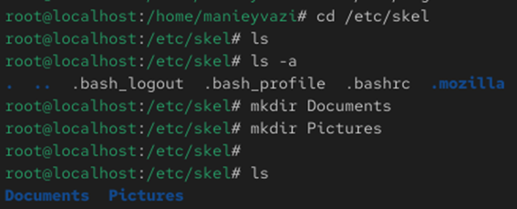
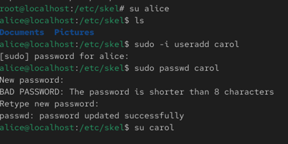
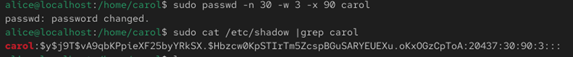

# Цели и задачи работы

## Цель лабораторной работы

Получение практических навыков управления учётными записями пользователей и групп в операционной системе Linux.

\newpage

# Процесс выполнения лабораторной работы

## Определение текущего пользователя

-

{ width=85% }

*Рис. 1 — Команды whoami и id*

\newpage

## Переключение на root

-

{ width=85% }

*Рис. 1 — Переход к пользователю root*

\newpage

## Файл /etc/sudoers

-

{ width=85% }

*Рис. 2 — Открытие /etc/sudoers через visudo*

\newpage

## Создание пользователя alice
-.

{ width=70% }

*Рис. 3 — Создание пользователя alice*

\newpage

## Создание пользователя bob

-.

{ width=85% }

*Рис. 3 — Создание пользователя bob*

\newpage

## Настройка параметров useradd

-.

{ width=60% }

*Рис. 4 — Файл /etc/login.defs*

\newpage

## Каталог /etc/skel

-.

{ width=80% }

*Рис. 5 — Каталог /etc/skel*

\newpage

## Создание пользователя carol

-.

{ width=85% }

*Рис. 6 — Создание пользователя carol*

\newpage

## Домашний каталог carol

Проверка работы системы.

{ width=85% }

*Рис. 7 — Домашний каталог carol*

\newpage

## Файл /etc/shadow

-

{ width=85% }

*Рис. 8 — Запись carol в /etc/shadow*

\newpage

## Создание групп

-

{ width=85% }

*Рис. 9 — Работа с группами*

\newpage

# Выводы по проделанной работе

## Вывод

В ходе лабораторной работы были изучены основные механизмы управления пользователями и группами в Linux.  
Получены практические навыки создания учётных записей, настройки прав доступа, управления паролями и группами, а также работы с ключевыми системными конфигурационными файлами.