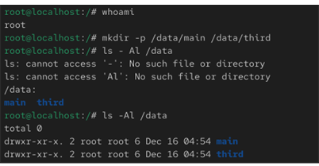
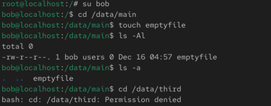
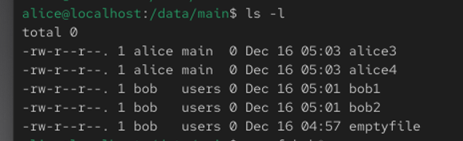
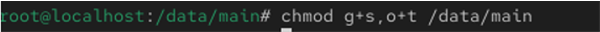
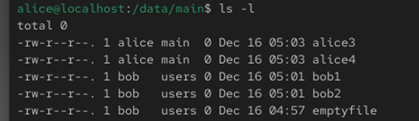
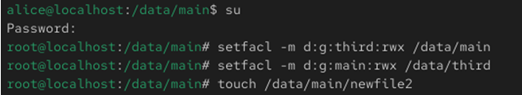
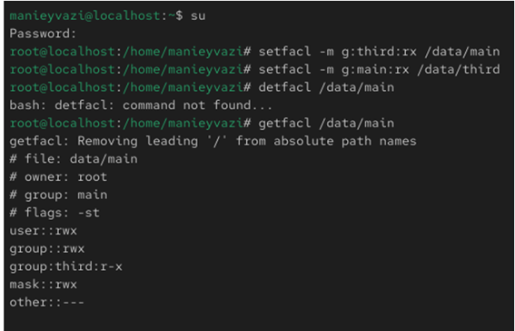
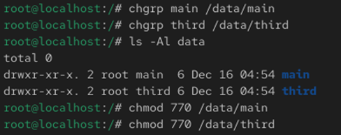
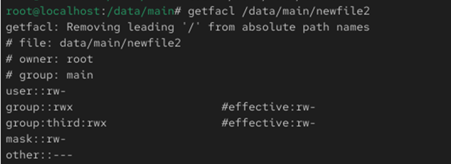

# Цели и задачи работы

## Цель лабораторной работы

Получение практических навыков настройки базовых, специальных и расширенных прав доступа  
для пользователей и групп в операционной системе Linux.

\newpage

# Процесс выполнения лабораторной работы

## Создание каталогов

-

{ width=85% }

*Рис. 1 — Создание каталогов /data/main и /data/third*

\newpage

## Проверка доступа пользователем bob

-.

{ width=85% }

*Рис. 2 — Работа пользователя bob*

\newpage

## Работа со специальными разрешениями

-

{ width=85% }

*Рис. 3 — Удаление файлов без sticky bit*

\newpage

## Установка setgid и sticky bit
-.

{ width=70% }

*Рис. 4 — Установка специальных битов*

\newpage

## Настройка ACL

-.

{ width=85% }

*Рис. 5 — Проверка ACL*

\newpage

## Проверка прав новых файлов (без ACL по умолчанию)

-.

{ width=85% }

*Рис. 6 — Права newfile1*

\newpage

## ACL по умолчанию

-.

{ width=80% }

*Рис. 7 — Наследование ACL*

\newpage

## Проверка ACL пользователем carol

-.

{ width=85% }

*Рис. 8 — H*

\newpage

## Проверка прав carol

.

{ width=85% }

*Рис. 9 — Проверка работы системы*

\newpage

# Выводы по проделанной работе

## Вывод

В ходе работы были изучены базовые, специальные и расширенные механизмы управления правами доступа в Linux.  
Полученные навыки позволяют гибко настраивать доступ пользователей и групп к файлам и каталогам  
в многопользовательской системе.