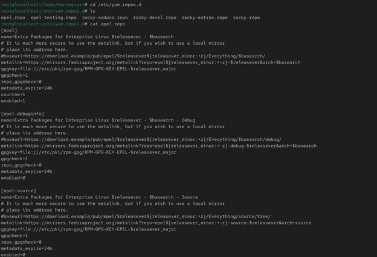
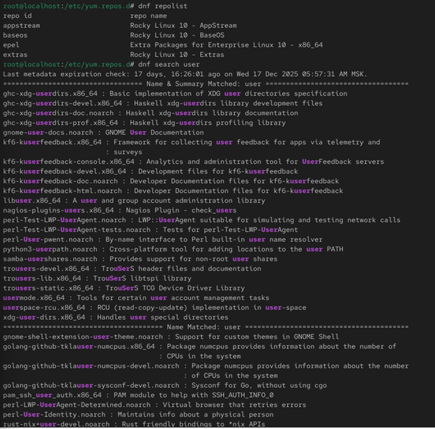
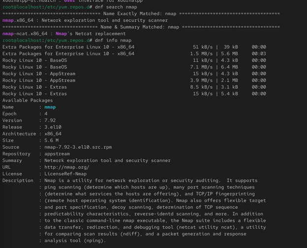
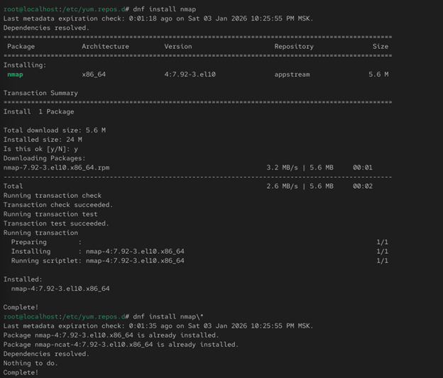
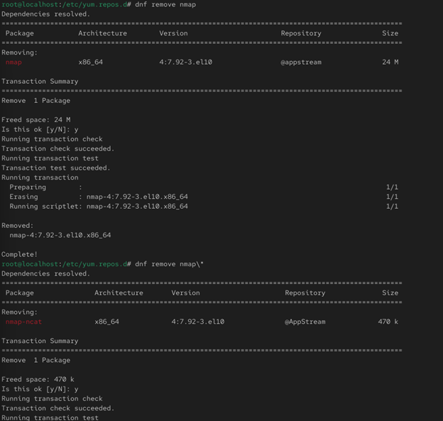
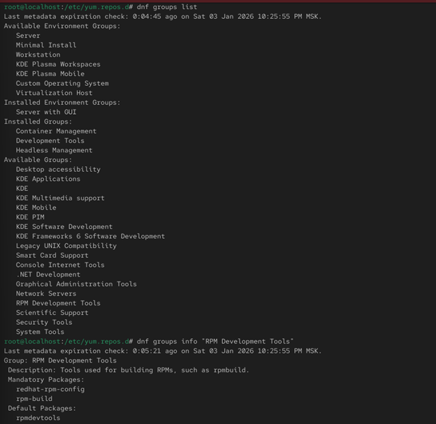
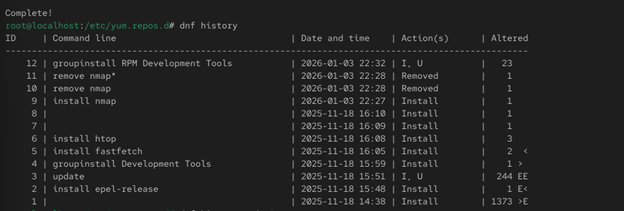
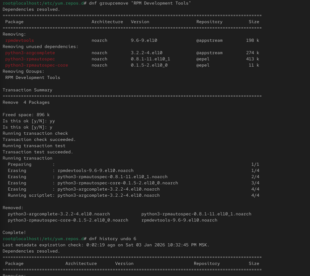
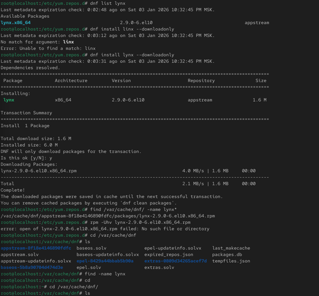
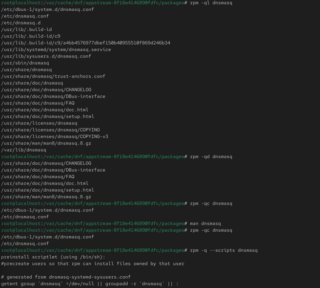

# Цели и задачи работы

## Цель лабораторной работы

Получение навыков работы с репозиториями, пакетным менеджером **dnf** и утилитой **rpm** в Linux.

\newpage

# Процесс выполнения лабораторной работы

## Работа с репозиториями

-

{ width=60% }

*Рис. 1 — Каталог /etc/yum.repos.d и файл rocky.repo*

\newpage

## Работа с репозиториями

-.

{ width=60% }

*Рис. 2 — Список репозиториев*

\newpage

## Поиск пакетов

-

{ width=60% }

*Рис. 3 — Информация о пакете nmap*

\newpage

## Установка пакета nmap
-.

{ width=60% }

*Рис. 4 — Установка пакета nmap*

\newpage

## Удаление пакета nmap

-.

{ width=60% }

*Рис. 5 — Работа с группами пакетов*

\newpage

## Работа с группами пакетов

-.

{ width=60% }

*Рис. 6 — Список групп пакетов*

\newpage

## Работа с группами пакетов

-.

{ width=60% }

*Рис. 7 — Установка группы RPM Development Tools*

\newpage

## Удаление группы пакетов

-.

{ width=60% }

*Рис. 8 — Удаление группы RPM Development Tools*

\newpage

## История операций dnf

Проверка работы системы.

{ width=60% }

*Рис. 9 — История dnf и откат действия*

\newpage

## Использование rpm (lynx)

-

{ width=60% }

*Рис. 10 — Загрузка пакета lynx*

\newpage

## Установка lynx

-

{ width=60% }

*Рис. 11 — Установка пакета lynx*

\newpage

## Информация о lynx

-

{ width=60% }

*Рис. 12 — Файлы пакета lynx*

\newpage

## Документация lynx

-

{ width=60% }

*Рис. 13 — Документация пакета lynx*

\newpage

## Man-страница lynx

-

{ width=60% }

*Рис. 14 — Справка man по lynx*

\newpage

## Запуск lynx 

-

{ width=60% }

*Рис. 15 — Работа браузера lynx*

\newpage

## Конфигурация lynx

-

{ width=60% }

*Рис. 16 — Конфигурационные файлы lynx*

\newpage

# Выводы по проделанной работе

## Вывод

В ходе работы были изучены основные приёмы управления пакетами в Linux с использованием менеджеров **dnf** и **rpm**.  
Были выполнены задачи по установке, обновлению и удалению программ, исследованию содержимого пакетов, их конфигурационных файлов, документации и установочных скриптов.  
Особое внимание уделялось различиям между установкой пакетов из репозиториев и установкой локальных rpm-файлов. 