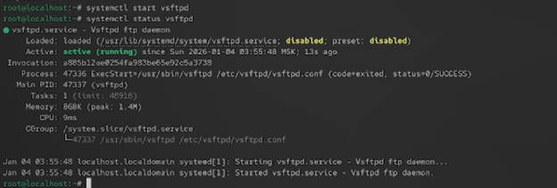
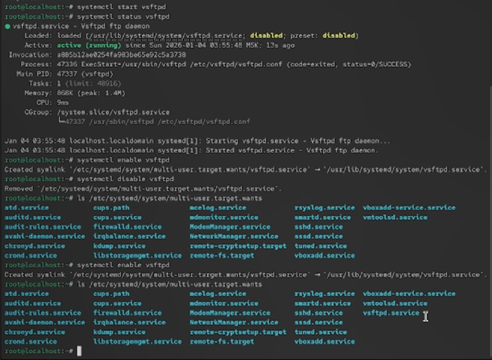
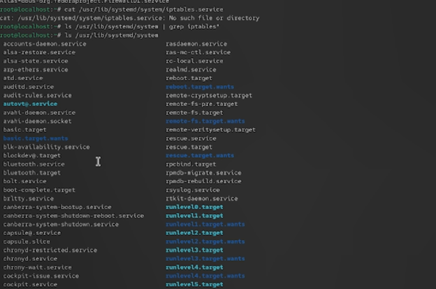
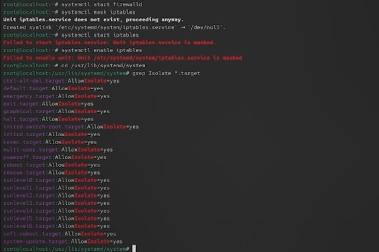
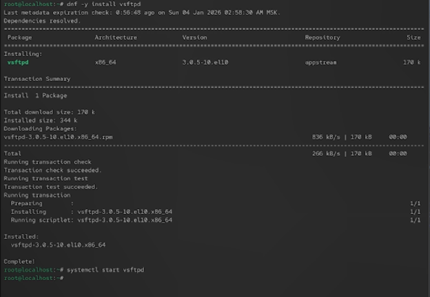
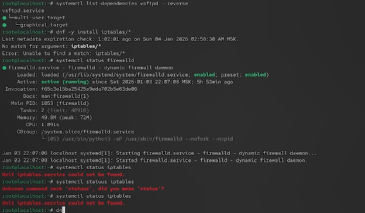
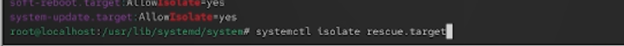
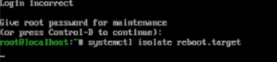

# Цели и задачи работы

## Цель лабораторной работы

Получить навыки управления системными службами операционной системы посредством systemd.

\newpage

# Процесс выполнения лабораторной работы

## Управление сервисами

-

{ width=85% }

*Рис. 1 — Проверка статуса службы vsftpd (сервис не найден)*

\newpage

## Управление сервисами

-.

{ width=85% }

*Рис. 2 — Запуск и проверка статуса vsftpd*

\newpage

## Управление сервисами

-

{ width=85% }

*Рис. 3 — Добавление vsftpd в автозапуск*

\newpage

## Управление сервисами
-.

{ width=70% }

*Рис. 4 — Удаление vsftpd из автозапуска*

\newpage

## Управление сервисами

-.

{ width=85% }

*Рис. 5 — Проверка каталога multi-user.target.wants*

\newpage

## Управление сервисами

-.

{ width=85% }

*Рис. 6 — Список юнитов, зависящих от vsftpd*

\newpage

## Конфликты юнитов

-.

{ width=80% }

*Рис. 7 — Установка iptables*

\newpage

## Конфликты юнитов

-.

{ width=85% }

*Рис. 8 — Статус firewalld и iptables*

\newpage

## Цель по умолчанию

Проверка работы системы.

{ width=85% }

*Рис. 9 — Определение текущей цели по умолчанию*

\newpage

## Цель по умолчанию

-

{ width=85% }

*Рис. 10 — Установка graphical.target по умолчанию*

\newpage

# Выводы по проделанной работе

## Вывод

results: В ходе работы были изучены механизмы управления сервисами и целями в системе systemd.

- Были выполнены задания по установке и запуску сервисов, их добавлению в автозагрузку и удалению из неё, а также анализу зависимостей.
- Особое внимание уделялось разрешению конфликтов между сервисами (firewalld и iptables) и маскированию юнитов.

Рассмотрены изолируемые цели systemd, их связь с уровнями запуска SystemV и настройка целей по умолчанию.