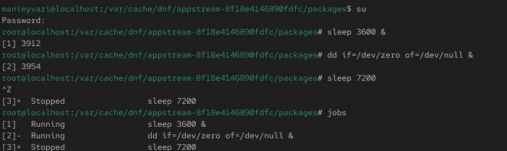
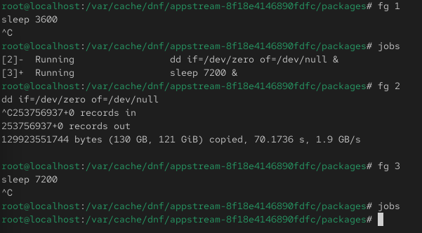
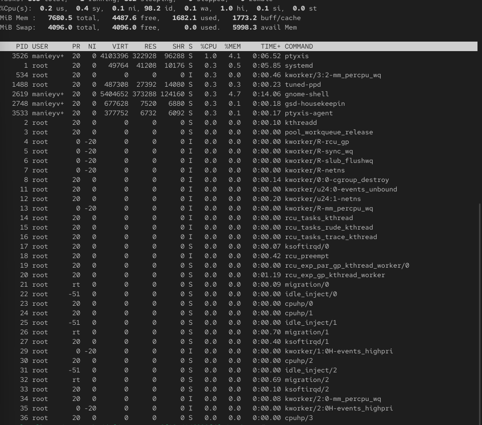
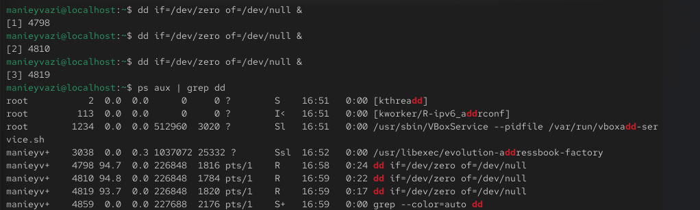
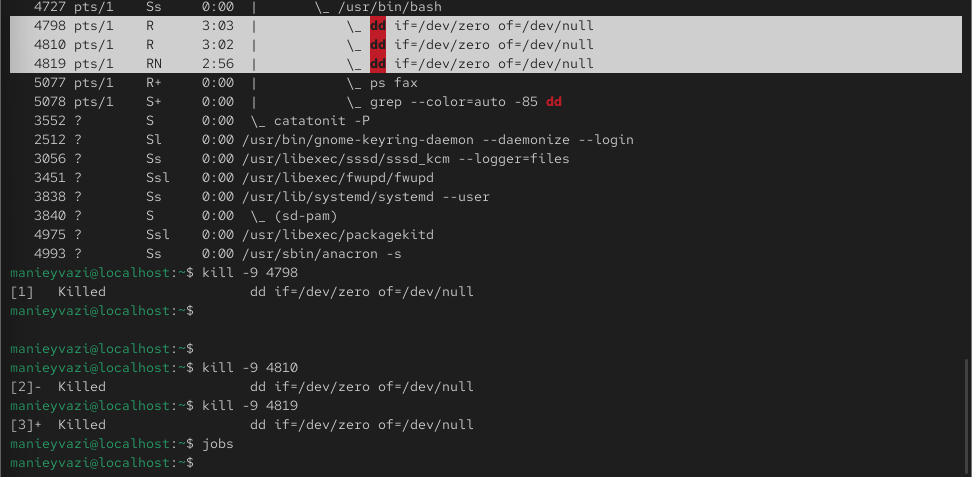

# Цели и задачи работы

## Цель лабораторной работы

Получение навыков управления заданиями и процессами в Linux.

\newpage

# Процесс выполнения лабораторной работы

## Управление заданиями

-

{ width=85% }

*Рис. 1 — Запущенные задания и остановка процесса*

\newpage

## Управление заданиями

-

{ width=85% }

*Рис. 2 — Запуск задания в фоновом режиме и проверка статуса*

\newpage

## Управление заданиями

-

{ width=70% }

*Рис. 3 — Завершение фоновых процессов*

\newpage

## Управление заданиями
-.

{ width=70% }

*Рис. 4 — Процесс dd в top*

\newpage

## Управление заданиями

-.

{ width=85% }

*Рис. 5 — Запуск процессов dd*

\newpage

## Управление заданиями

-.

{ width=85% }

*Рис. 6 — Список процессов dd*

\newpage

## Управление заданиями

-.

{ width=80% }

*Рис. 7 — Иерархия процессов dd*

\newpage

## Задание 1

-.

{ width=85% }

*Рис. 8 — Изменение приоритета и завершение процессов dd*

\newpage

## Задание 2

Проверка работы системы.

{ width=85% }

*Рис. 9 — Запуск yes в фоне*

\newpage

## Задание 2

-

{ width=85% }

*Рис. 10 — Остановка и перевод yes в фоновый режим*

\newpage

# Выводы по проделанной работе

## Вывод

В ходе работы были изучены основные приёмы управления заданиями и процессами в Linux.
Были рассмотрены способы запуска и остановки программ, управление приоритетами, завершение процессов.
Использовались команды jobs, fg, bg, kill, killall, nohup, а также утилиты ps и top.