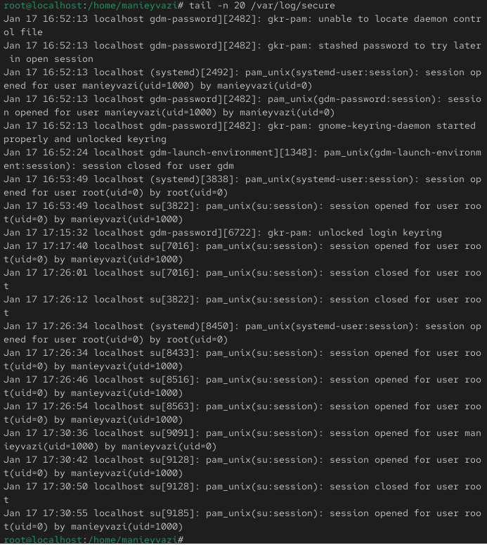
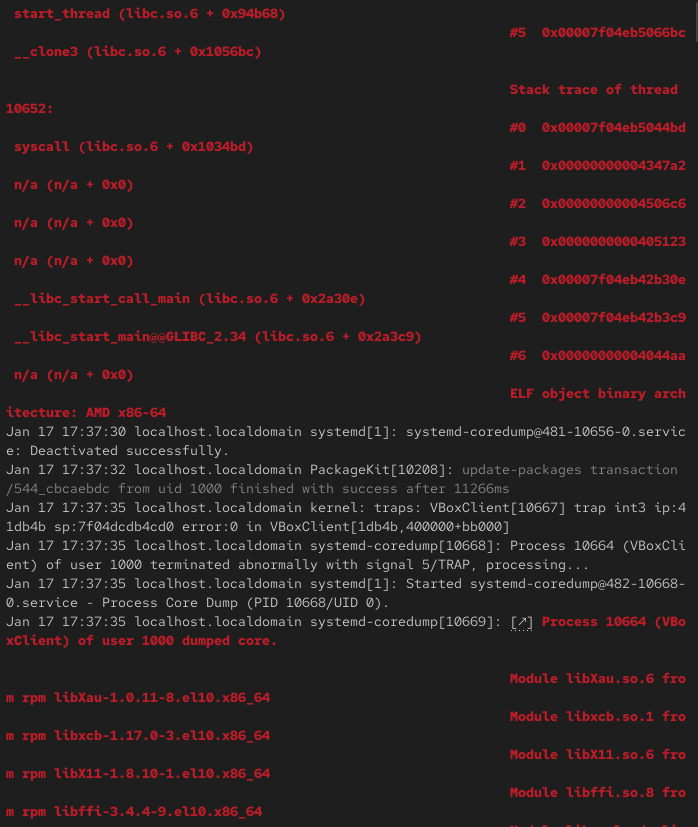
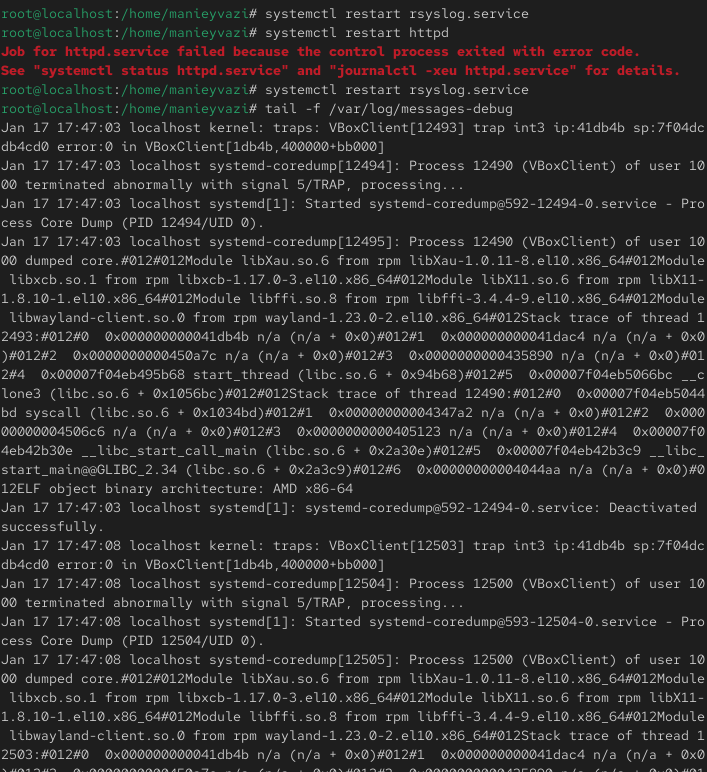
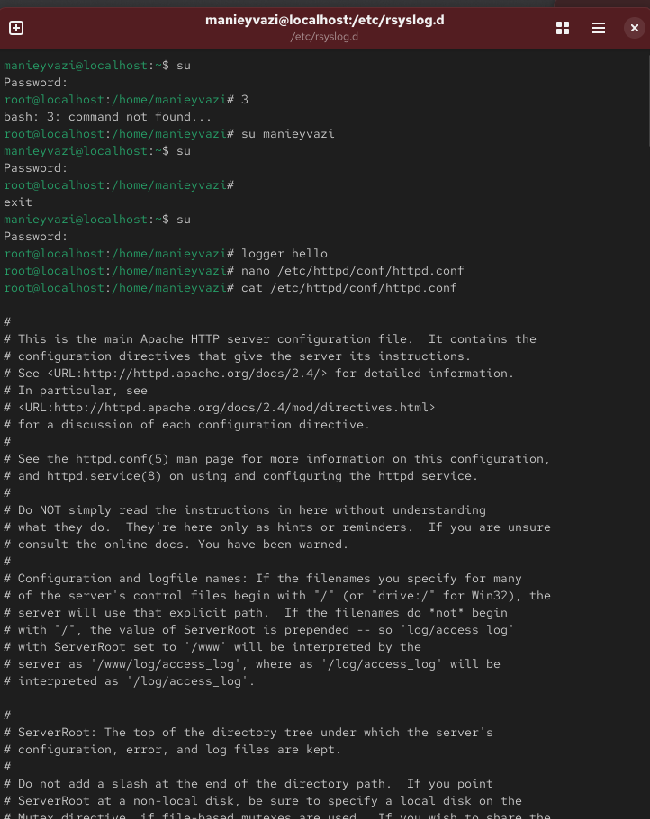
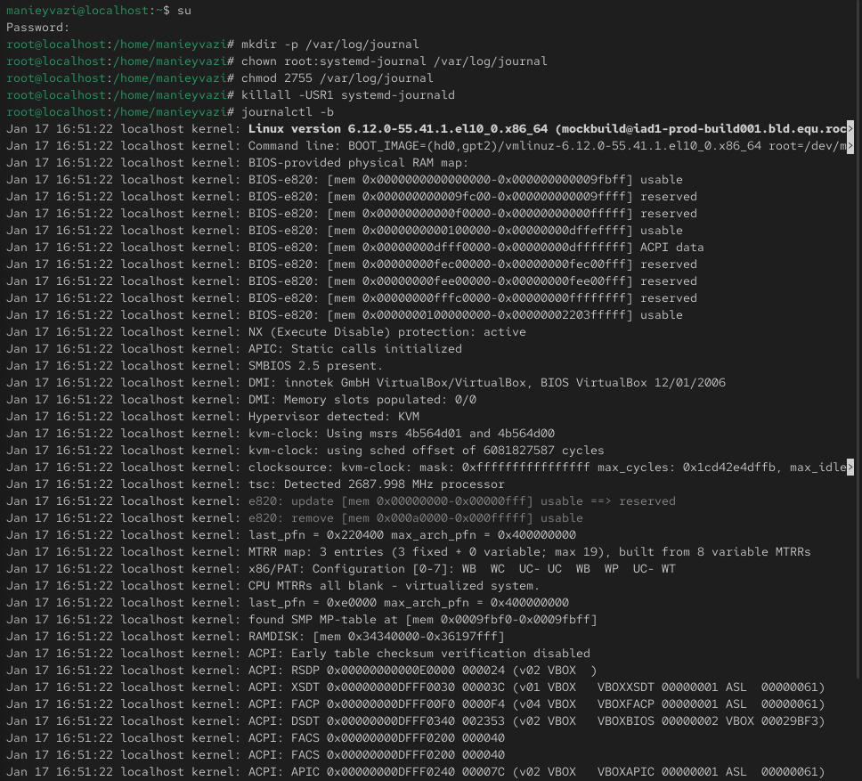
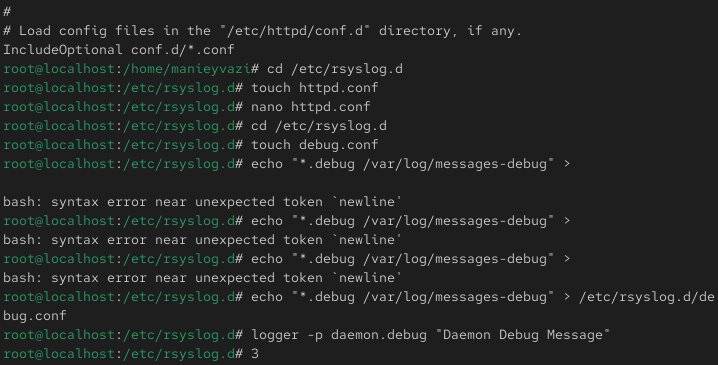
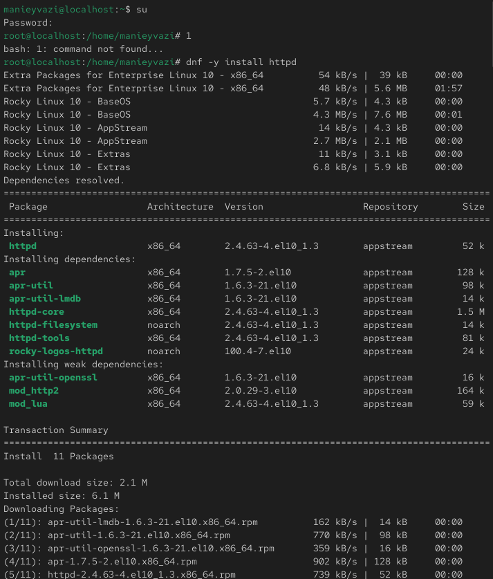

# Цели и задачи работы

## Цель лабораторной работы

Получить навыки работы с журналами мониторинга различных событий в системе Linux, используя службы rsyslog и systemd-journald.

\newpage

# Процесс выполнения лабораторной работы

## Мониторинг системных событий

-

{ width=50% }

*Рис. 1 — Мониторинг /var/log/messages в реальном времени*

\newpage

## Ошибки аутентификации su

-.

{ width=50% }

*Рис. 2 — Сообщения об ошибках su в журнале*

\newpage

## Использование команды logger

-

{ width=50% }

*Рис. 3 — Добавление пользовательского сообщения в журнал*

\newpage

## Журнал безопасности /var/log/secure
-.

{ width=50% }

*Рис. 4 — Просмотр последних записей журнала secure*

\newpage

## Изменение правил rsyslog.conf

-.

{ width=50% }

*Рис. 5 — Запуск службы httpd и её журнал*

\newpage

## Настройка веб-сервера Apache

-.

{ width=50% }

*Рис. 6 — Изменение конфигурации httpd.conf*

\newpage

## Настройка ErrorLog syslog:local1

-.

{ width=50% }

*Рис. 7 — Файл /etc/rsyslog.d/httpd.conf*

\newpage

## Создание файла правил httpd.conf

-.

{ width=50% }

*Рис. 8 — Файл /etc/rsyslog.d/debug.conf*

\newpage

## Создание файла debug.conf

{ width=50% }

*Рис. 9 — Сообщение от logger в messages-debug*

\newpage

## Проверка записи отладочных сообщений

-

{ width=50% }

*Рис. 10 — Просмотр системного журнала*

\newpage

# Выводы по проделанной работе

## Вывод

В ходе лабораторной работы были изучены принципы системного журналирования в Linux.
Были рассмотрены возможности служб rsyslog и systemd-journald, настройка пользовательских правил, регистрация ошибок и отладочной информации.
Освоены команды фильтрации и анализа логов с помощью journalctl, а также способы организации постоянного хранения журналов для долгосрочного мониторинга системы.