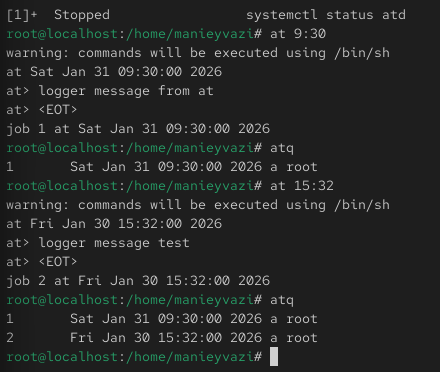
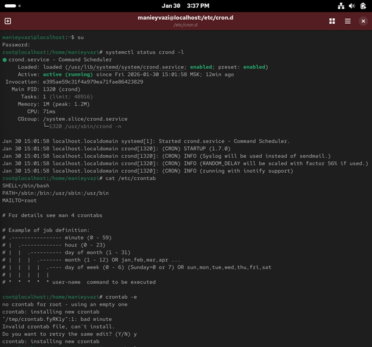
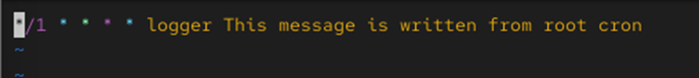
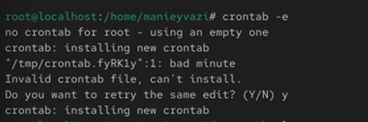
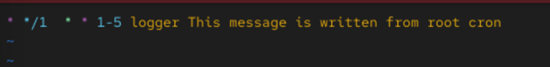
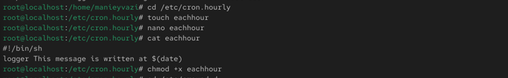
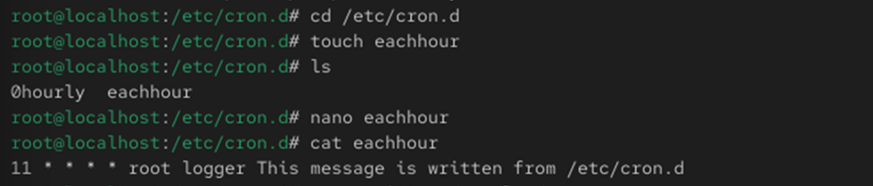
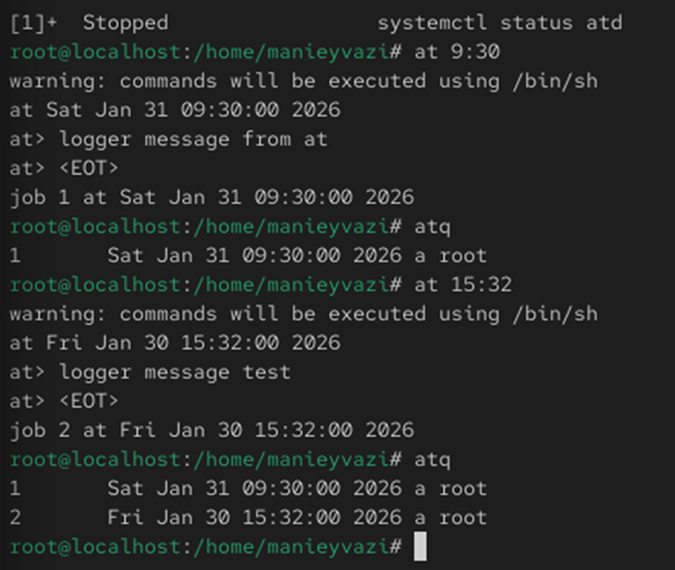

# Цели и задачи работы

## Цель лабораторной работы

Изучение принципов работы системных планировщиков cron и at, настройка периодических и однократных заданий, анализ выполнения задач через системные журналы.

\newpage

# Процесс выполнения лабораторной работы

## Проверка службы crond

-

{ width=70% }

*Рис. 1 — Проверка статуса службы crond*

\newpage

## Просмотр конфигурации /etc/crontab

-.

{ width=60% }

*Рис. 2 — Содержимое файла /etc/crontab*

\newpage

## Добавление задания в crontab

-

{ width=85% }

*Рис. 3 — Редактирование crontab*

\newpage

## Проверка выполнения задания
-.

{ width=70% }

*Рис. 4 — Список заданий и результат в логе*

\newpage

## Изменение расписания

-.

{ width=85% }

*Рис. 5 — Изменение расписания выполнения задачи*

\newpage

## Создание сценария eachhour

-.

{ width=85% }

*Рис. 6 — Создание сценария eachhour в /etc/cron.hourly*

\newpage

## Создание задания в /etc/cron.d

-.

{ width=80% }

*Рис. 7 — Создание задания в /etc/cron.d*

\newpage

## Проверка службы atd

-.

{ width=70% }

*Рис. 8 — Проверка состояния службы atd*

\newpage

## Создание и выполнение задания at

Проверка работы системы.

{ width=70% }

*Рис. 9 — Создание и выполнение задания at*

\newpage

# Выводы по проделанной работе

## Вывод

В ходе работы были изучены средства планирования заданий в Linux с помощью утилит cron и at.
Были рассмотрены различные способы создания расписаний, системные каталоги /etc/cron.hourly и /etc/cron.d, а также работа с однократными заданиями atd.
Закреплены практические навыки администрирования и анализа выполнения системных задач.