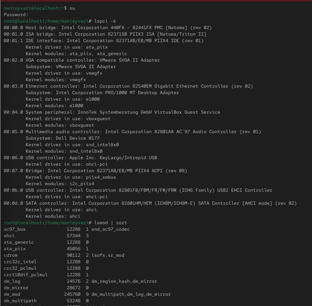
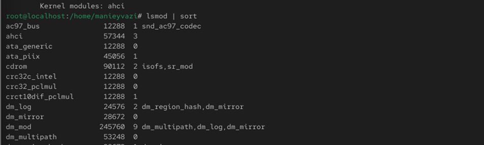
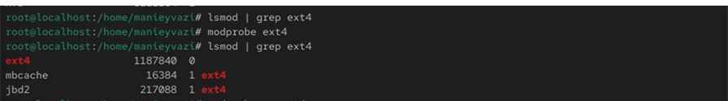
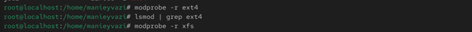
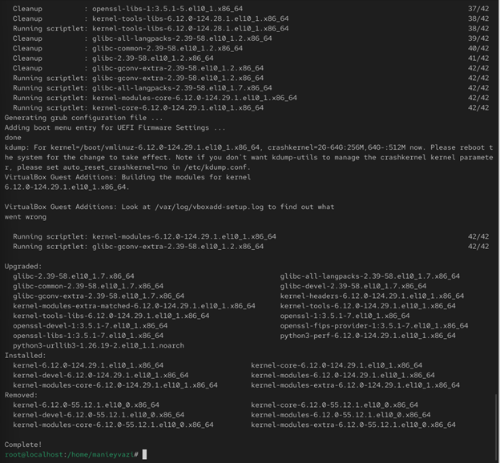
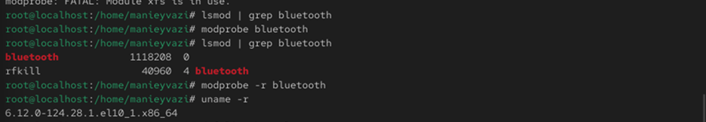
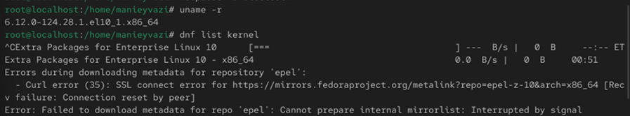
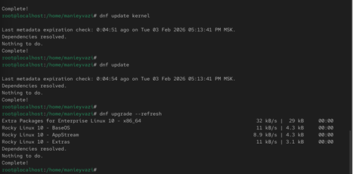

# Цели и задачи работы

## Цель лабораторной работы

Получение навыков работы с утилитами управления модулями ядра операционной системы Linux.

\newpage

# Процесс выполнения лабораторной работы

## Управление модулями ядра

-

{ width=60% }

*Рис. 1 — Вывод команды lspci -k*

\newpage

## Управление модулями ядра

-.

{ width=85% }

*Рис. 2 — Список загруженных модулей ядра*

\newpage

## Загрузка модуля ext4

-

{ width=85% }

*Рис. 3 — Информация о модуле ext4*

\newpage

## Выгрузка модулей
-.

{ width=85% }

*Рис. 4 — Выгрузка модулей ext4 и xfs*

\newpage

## Загрузка модуля bluetooth

-.

{ width=70% }

*Рис. 5 — Загрузка модуля bluetooth*

\newpage

## Информация и параметры bluetooth

-.

{ width=85% }

*Рис. 6 — Информация и выгрузка модуля bluetooth*

\newpage

## Проверка версии ядра

-.

{ width=80% }

*Рис. 7 — Проверка версии и списка пакетов ядра*

\newpage

## Обновление системы и ядра

-.

{ width=85% }

*Рис. 8 — Обновление ядра и системы*

\newpage

## Проверка новой версии ядра

Проверка работы системы.

{ width=85% }

*Рис. 9 — Проверка версии ядра и информации о системе*

\newpage

# Выводы по проделанной работе

## Вывод

В ходе работы были изучены основные приёмы управления модулями ядра в Linux.
Были рассмотрены команды для загрузки, выгрузки и анализа модулей, а также получены навыки обновления ядра системы с помощью dnf.
Работа позволила закрепить практические знания по администрированию ядра и модульной архитектуры Linux