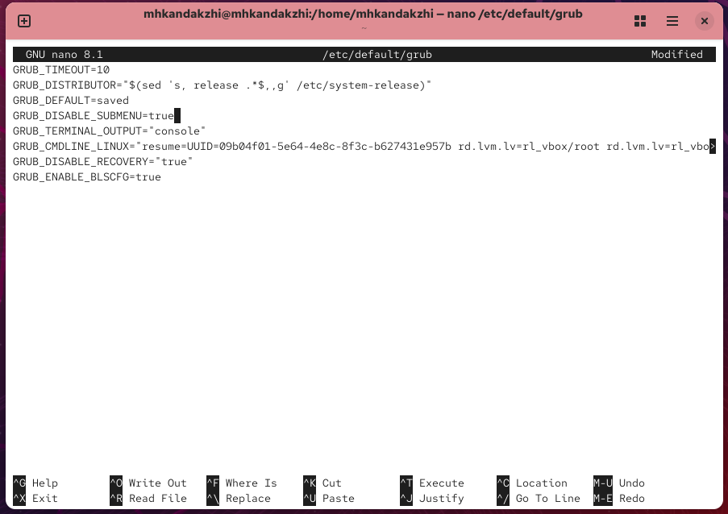
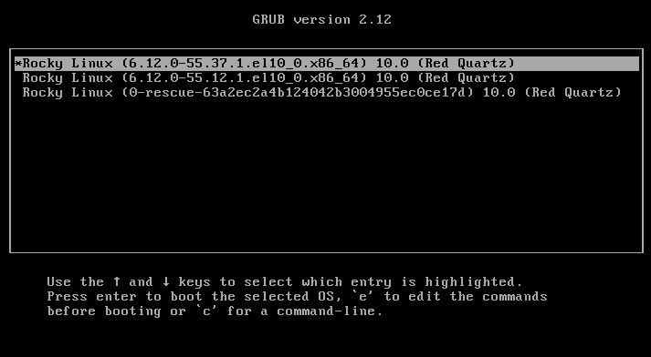
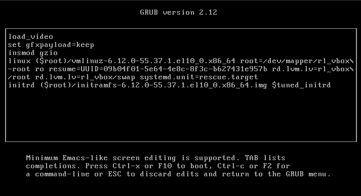
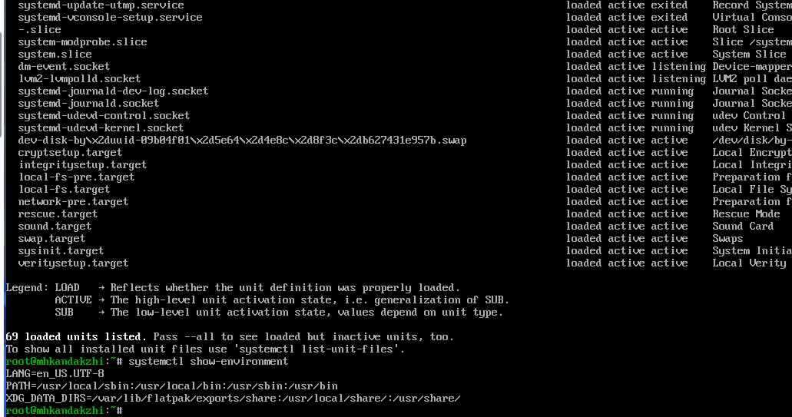
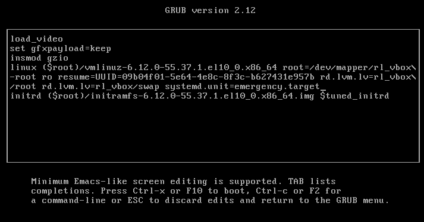
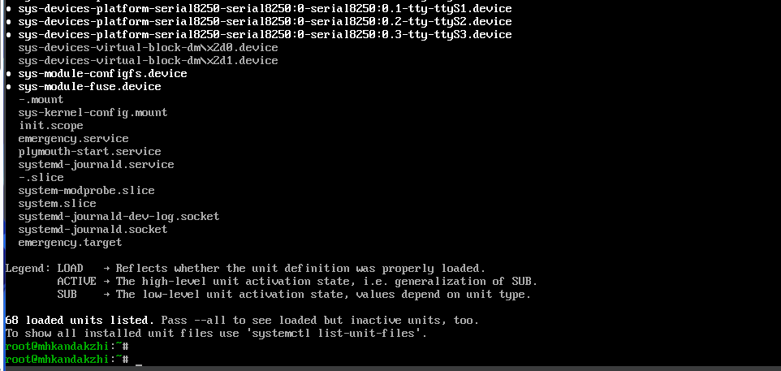
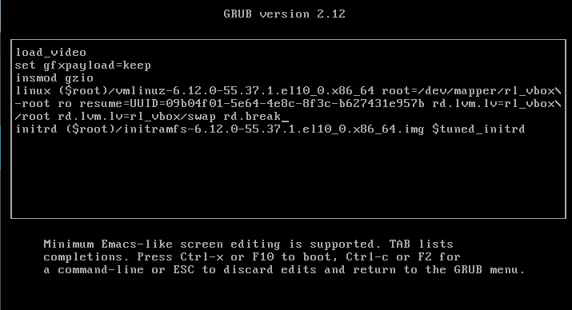
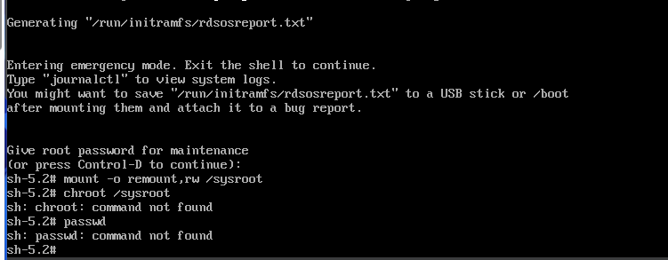

# Цели и задачи работы

## Цель лабораторной работы

Получить навыки работы с загрузчиком системы GRUB2 в Linux.

\newpage

# Процесс выполнения лабораторной работы

## Изменение параметров GRUB2

-

{ width=70% }

*Рис. 1 — Редактирование файла /etc/default/grub*

\newpage

## Генерация конфигурации GRUB2

-.

{ width=85% }

*Рис. 2 — Создание новой конфигурации GRUB2*

\newpage

## Меню загрузки системы

-

{ width=85% }

*Рис. 3 — Меню загрузки GRUB*

\newpage

## Вход в режим восстановления
-.

{ width=70% }

*Рис. 4 — Редактирование строки загрузки (rescue mode)*

\newpage

## Активные юниты в rescue mode

-.

{ width=85% }

*Рис. 5 — Список активных юнитов в rescue mode*

\newpage

## Вход в emergency mode

-.

{ width=85% }

*Рис. 6 — Редактирование строки загрузки (emergency mode)*

\newpage

## Активные службы в emergency mode

-.

{ width=80% }

*Рис. 7 — Список юнитов в emergency mode*

\newpage

## Загрузка с параметром rd.break

-.

{ width=85% }

*Рис. 8 — Редактирование строки загрузки с параметром rd.break*

\newpage

## Попытка сброса пароля root

Проверка работы системы.

{ width=85% }

*Рис. 9 — Попытка сброса пароля root*

\newpage

# Выводы по проделанной работе

## Вывод

В ходе работы были изучены основные приёмы настройки и модификации загрузчика GRUB2 в операционной системе Linux.
Были рассмотрены процессы изменения параметров конфигурационного файла /etc/default/grub, генерации нового файла /boot/grub2/grub.cfg и проверка результатов при загрузке системы.
Дополнительно были исследованы режимы rescue и emergency, а также порядок действий при сбросе пароля суперпользователя root.