# Цели и задачи работы

## Цель лабораторной работы

Получение практических навыков настройки сетевых параметров в Linux с использованием утилит ip, nmcli и nmtui.

\newpage

# Процесс выполнения лабораторной работы

## Получение прав администратора

Для выполнения сетевых настроек были получены права суперпользователя с помощью команды su -.

\newpage

## Информация об интерфейсах

-.

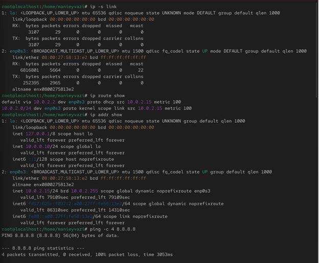{ width=70% }

*Рис. 1 — Интерфейсы и статистика пакетов*

\newpage

## Маршруты и IP-адреса

-

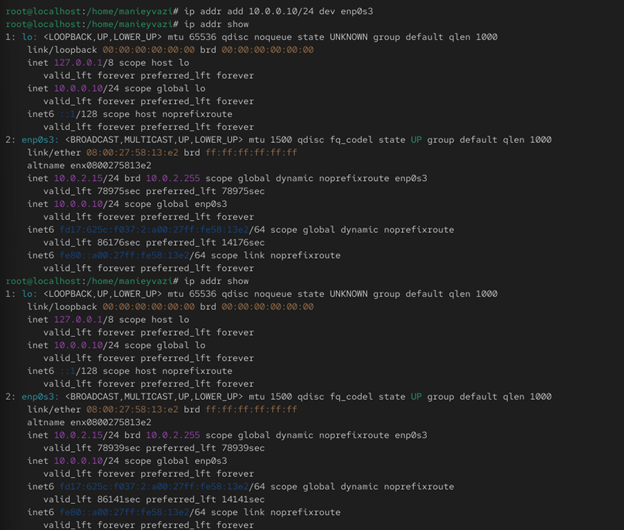{ width=70% }

*Рис. 2 — Таблица маршрутизации*

\newpage

## Проверка соединения
-.

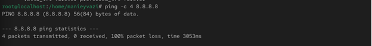{ width=75% }

*Рис. 3 — Проверка соединения с помощью ping*

\newpage

## Добавление нового IP

-.

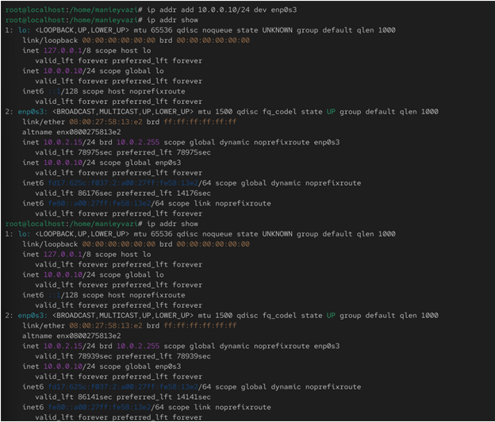{ width=70% }

*Рис. 4 — Добавление нового IP-адреса*

\newpage

## Сравнение ip и ifconfig

-.

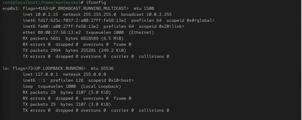{ width=85% }

*Рис. 5 — Вывод команды ifconfig*

\newpage

## Проверка открытых портов

-.

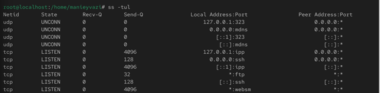{ width=80% }

*Рис. 6 — Список открытых портов TCP и UDP*

\newpage

## Просмотр и создание подключений

-.

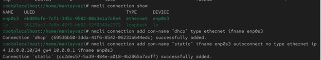{ width=85% }

*Рис. 7 — Список существующих подключений*

\newpage

## Активация соединений

Проверка работы системы.

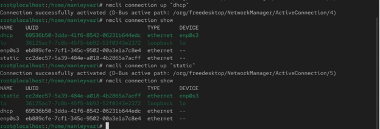{ width=85% }

*Рис. 8 — Активация статического соединения и проверка IP*

\newpage

## Настройка DNS и адресов

-

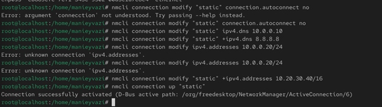{ width=85% }

*Рис. 9 — Изменение параметров и проверка IP*

\newpage

## Просмотр профилей в nmtui

-

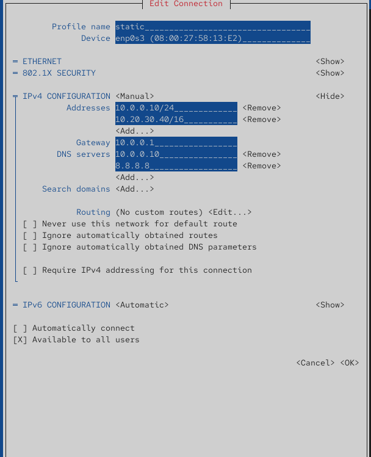{ width=45% }

*Рис. 10 — Настройки соединения static в nmtui*

\newpage

## Просмотр через графический интерфейс

-

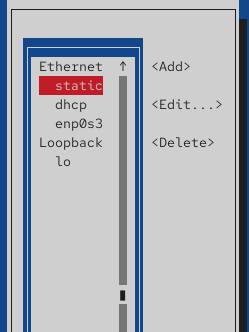{ width=45% }

*Рис. 11 — Просмотр настроек static в графическом интерфейсе*

\newpage

# Выводы по проделанной работе

## Вывод

В ходе работы были освоены средства настройки сети в Linux:

- команды ip, nmcli, nmtui;
- управление профилями DHCP и статической конфигурации;
- настройка DNS, шлюзов и дополнительных IP-адресов.

Результатом стало полное понимание принципов работы сетевой конфигурации в ОС семейства RHEL.