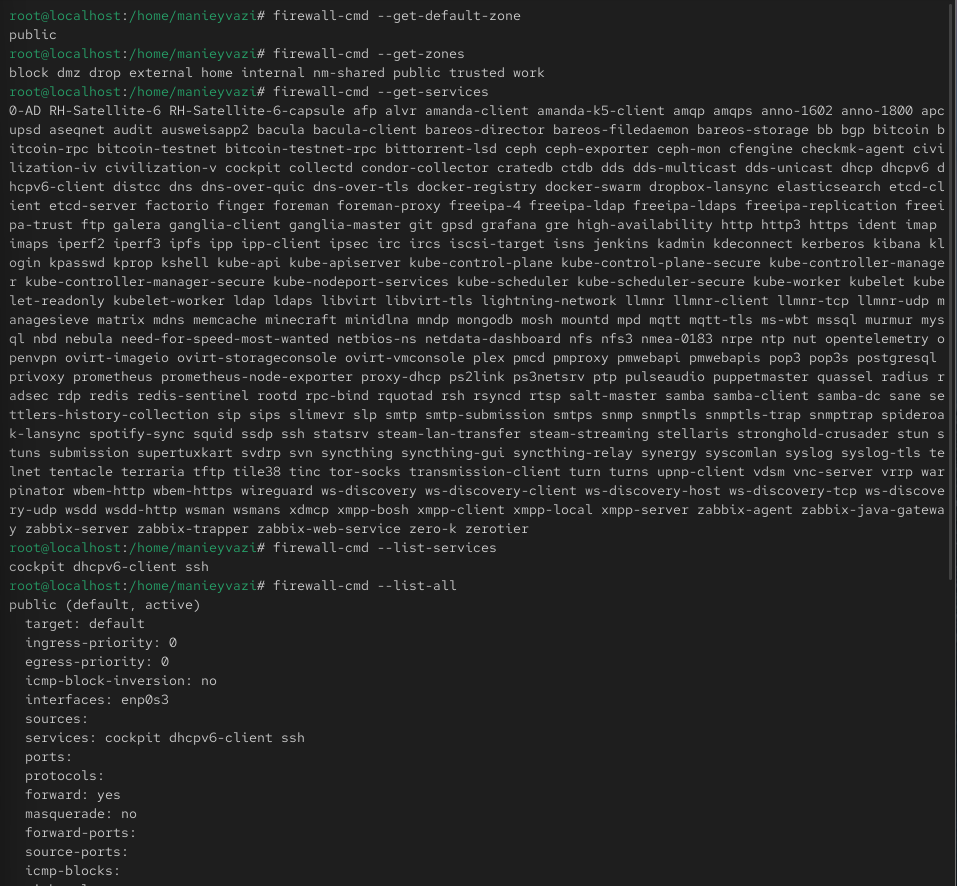
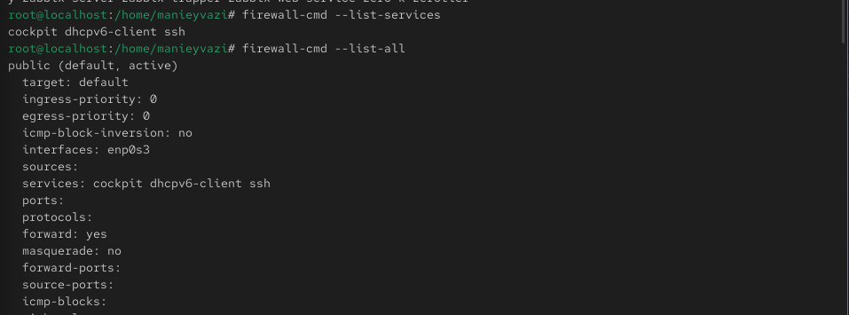
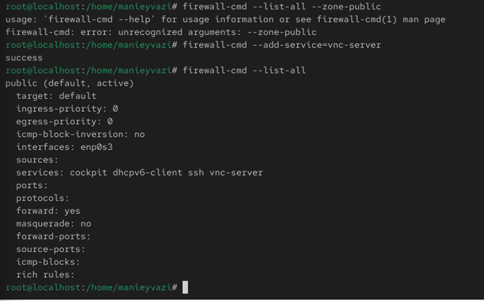
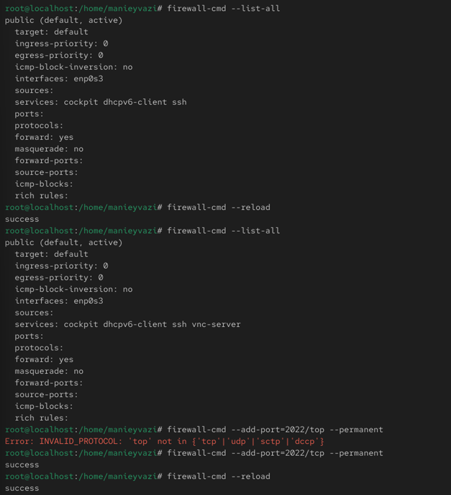
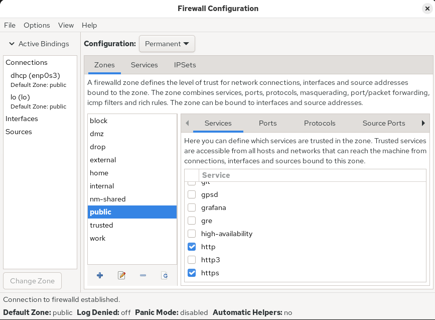
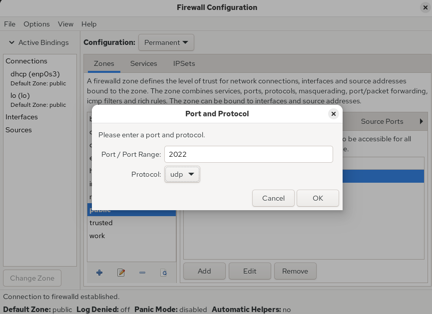
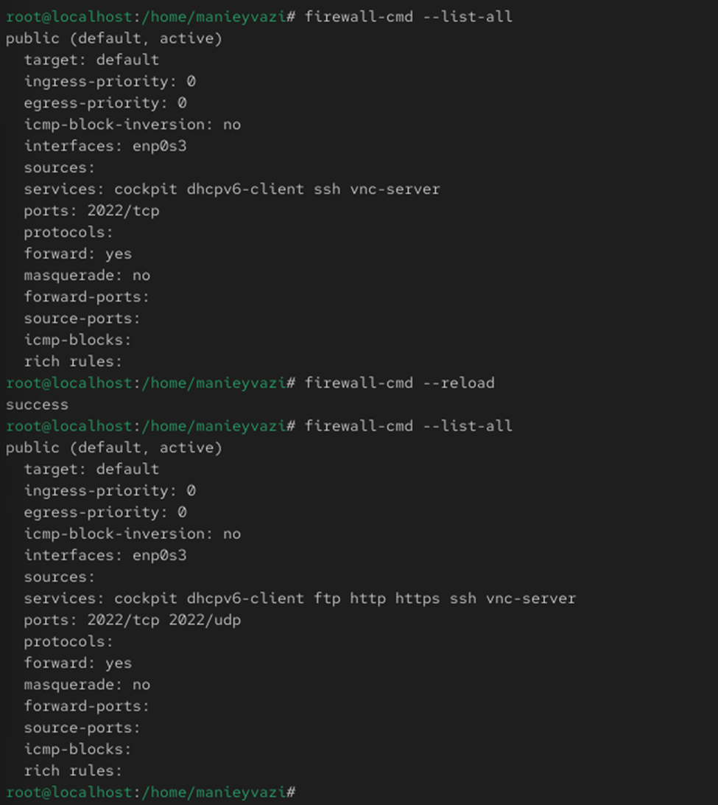

# Цели и задачи работы

## Цель лабораторной работы

Получить навыки работы с межсетевым экраном в Linux
и научиться управлять правилами фильтрации пакетов через:

- firewall-cmd (CLI)
- firewall-config (GUI)

\newpage

# Процесс выполнения лабораторной работы

## Определение конфигурации

-

{ width=50% }

*Рис. 1 — Список зон и служб*

\newpage

## Анализ активной зоны

-.

{ width=85% }

*Рис. 2 — Параметры зоны public*

\newpage

## Добавление сервиса (временное изменение)

-

{ width=85% }

*Рис. 3 — Добавление VNC и исчезновение после рестарта*

\newpage

## Добавление сервиса(постоянное изменение)
-.

{ width=70% }

*Рис. 4 — Добавление VNC permanent*

\newpage

## Добавление порта 2022/TCP

-.

{ width=50% }

*Рис. 5 — Добавление порта 2022/tcp*

\newpage

## Включение служб

-.

{ width=85% }

*Рис. 6 — GUI firewall-config services*

\newpage

## Добавление порта

-.

{ width=80% }

*Рис. 7 — GUI firewall-config port*

\newpage

## Проверка результата

-.

{ width=50% }

*Рис. 8 — Список активных служб и портов*

\newpage

## Добавление служб

Проверка работы системы.

{ width=50% }

*Рис. 9 — Добавление служб через GUI*

\newpage

## Проверка конфигурации

-

{ width=85% }

*Рис. 10 — Итоговая конфигурация*

\newpage

# Выводы по проделанной работе

## Вывод

- Изучены инструменты управления брандмауэром: **firewall-cmd** и **firewall-config**
- Освоены:
  - просмотр зон и разрешённых служб
  - добавление портов и сервисов
  - различие между временной и постоянной конфигурацией
- На практике закреплено применение параметра `--permanent`  
  и активация изменений через `firewall-cmd --reload`