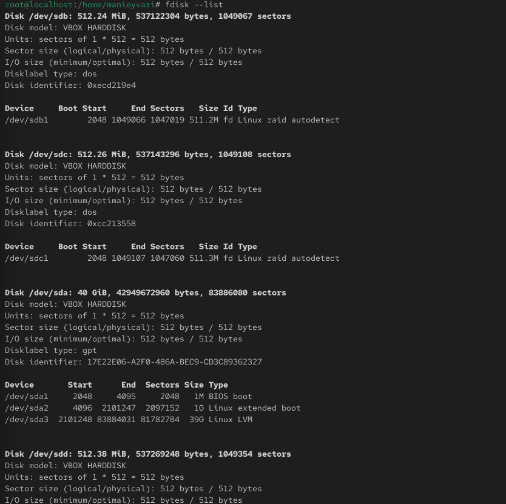
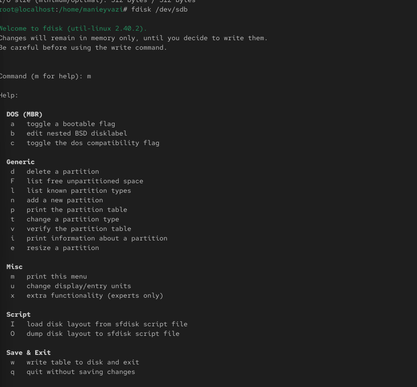
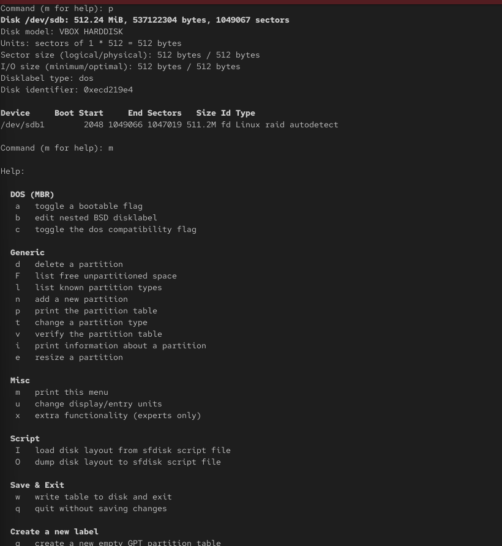
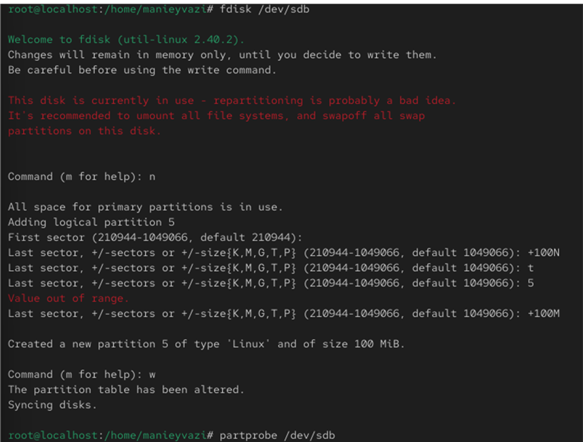
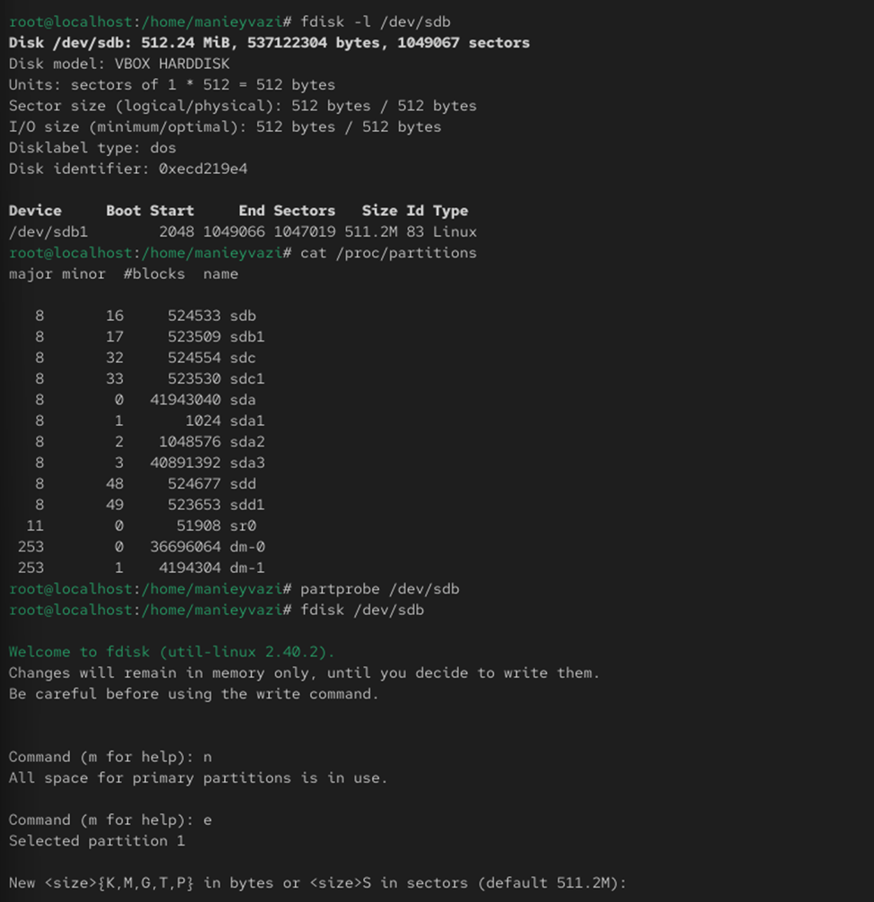
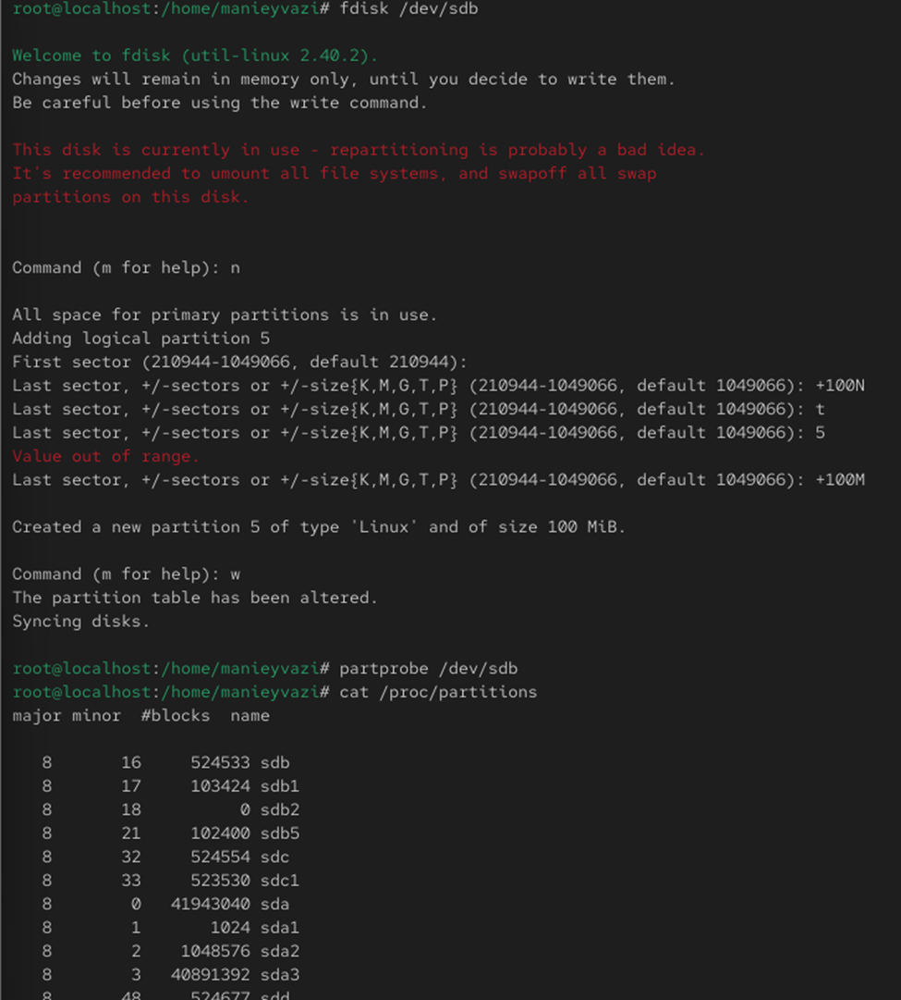
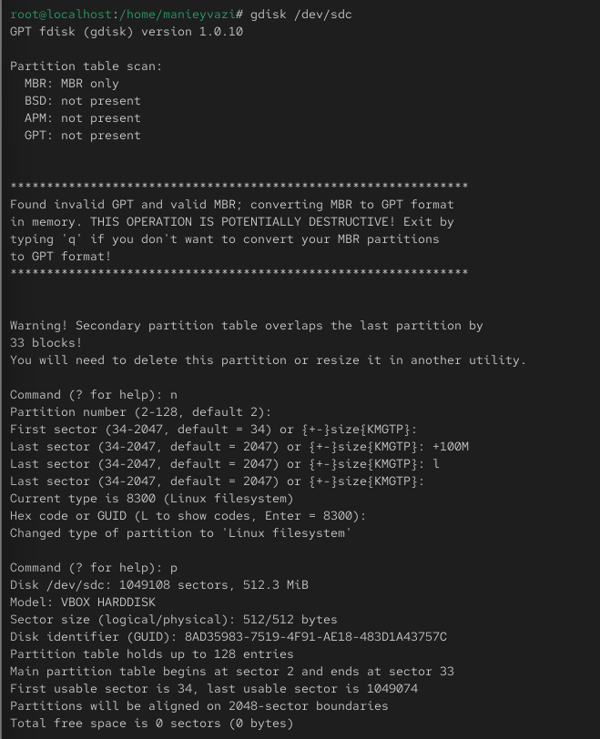

# Цели и задачи работы

## Цель лабораторной работы

Получить практические навыки разметки дисков (MBR и GPT), создания файловых систем, настройки раздела подкачки и монтирования файловых систем (ручного и автоматического) в Linux.

\newpage

# Процесс выполнения лабораторной работы

## Проверка доступных устройств

-

{ width=50% }

*Рис. 1 — Вывод команды fdisk -l*

\newpage

## Обновление таблицы разделов ядра

-.

{ width=50% }

*Рис. 2 — Проверка таблицы разделов и обновление настроек ядра*

\newpage

## Форматирование и активация swap

-

{ width=50% }

*Рис. 3 — Создание и активация swap-раздела*

\newpage

##  Проверка автоматического монтирования
-.

{ width=50% }

*Рис. 4 — Проверка автоматического монтирования*

\newpage

## Самостоятельная часть: создание GPT-разделов

-.

{ width=50% }

*Рис. 5 — Создание двух GPT-разделов*

\newpage

## Самостоятельная часть: ext4 и swap

-.

{ width=50% }

*Рис. 6 — Создание ext4 и swap*

\newpage

## Самостоятельная часть: проверка монтирования и swap

-.

{ width=50% }

*Рис. 7 — Проверка монтирования и swap*

\newpage

# Выводы по проделанной работе

## Вывод

В ходе лабораторной работы были освоены:

- разметка дисков с использованием таблиц разделов MBR и GPT (создание основных, расширенных и логических разделов);
- создание и настройка файловых систем XFS и EXT4;
- выделение и активация раздела подкачки (swap);
- ручное монтирование разделов и работа с точками монтирования;
- настройка автоматического монтирования разделов через файл /etc/fstab и проверка корректности конфигурации.
Полученные навыки закрепили понимание принципов работы с блочными устройствами и файловыми системами в Linux и являются базой для дальнейшей администрирования дисковой подсистемы.