# Цели и задачи работы

## Цель лабораторной работы

Получить навыки создания, управления и модификации логических томов LVM.

\newpage

# Процесс выполнения лабораторной работы

## Создание физического тома

-

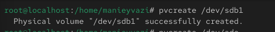{ width=85% }

*Рис. 1 — Очистка и разметка диска /dev/sdb*

\newpage

## Проверка VG

-.

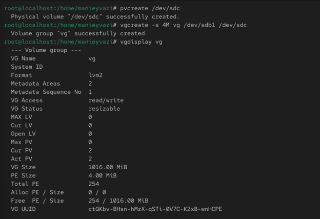{ width=85% }

*Рис. 2 — Вывод vgs*

\newpage

## Создание файловой системы

-

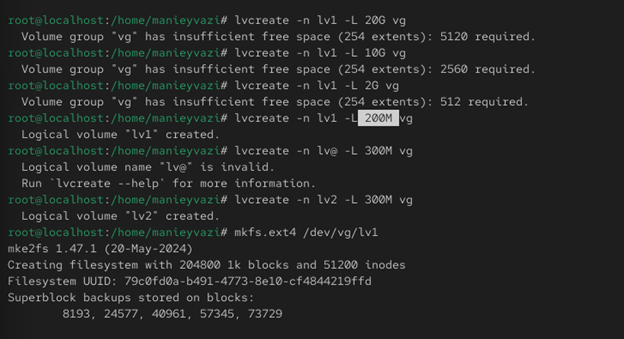{ width=85% }

*Рис. 3 — Создание файловой системы*

\newpage

## Редактирование fstab
-.

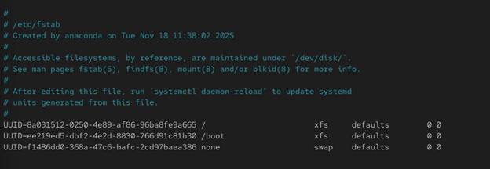{ width=70% }

*Рис. 4 — Редактирование fstab*

\newpage

## Проверка монтирования	

-.

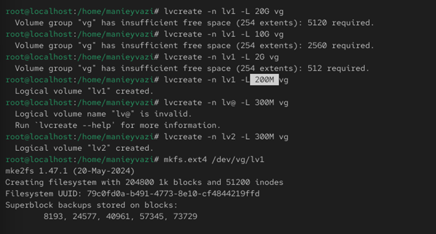{ width=85% }

*Рис. 5 — Монтирование LV*

\newpage

## Добавление нового раздела

-.

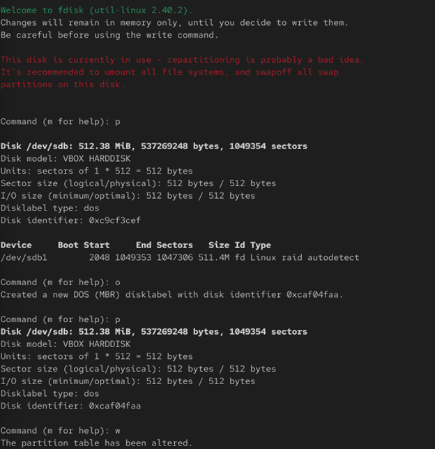{ width=55% }

*Рис. 6 — Создание /dev/sdb2*

\newpage

## Увеличение VG

-.

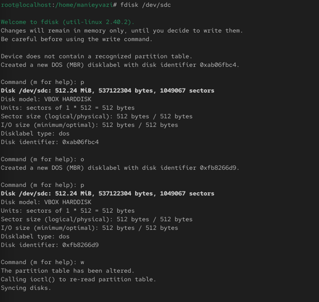{ width=55% }

*Рис. 7 — Увеличение VG*

\newpage

## Увеличение размера LV

-.

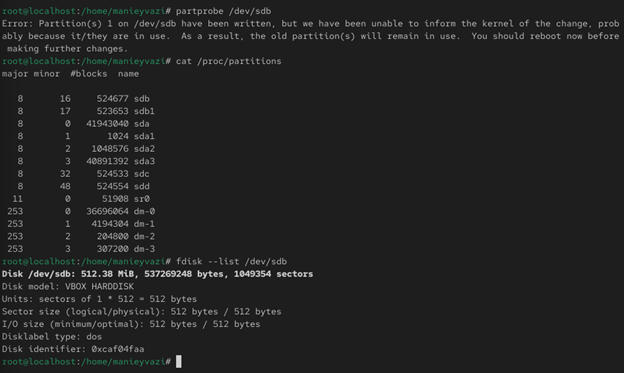{ width=85% }

*Рис. 8 — Увеличение LV*

\newpage

## Уменьшение размера LV

Проверка работы системы.

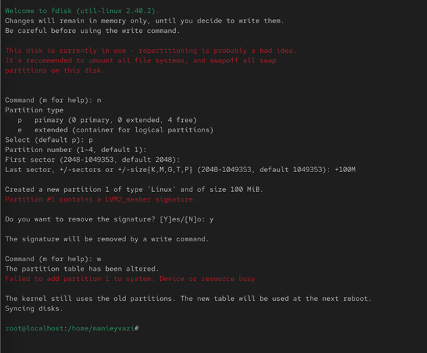{ width=60% }

*Рис. 9 — Уменьшение LV*

\newpage

## Создание PV/VG/LV

-

{ width=85% }

*Рис. 11 — Создание PV, VG и LV*

\newpage

## Настройка fstab

-

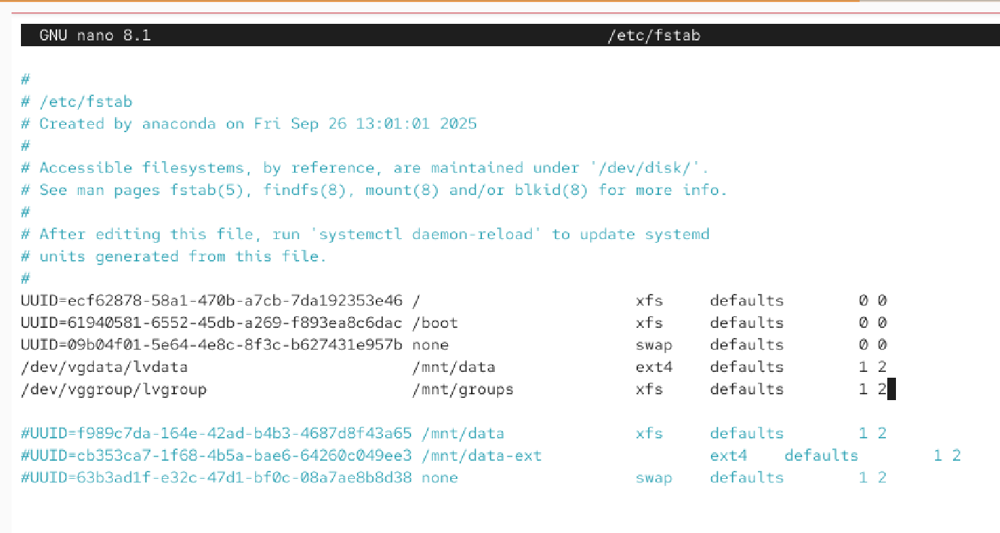{ width=85% }

*Рис. 12 — Настройка fstab*

\newpage

## Создание нового PV для расширения

-

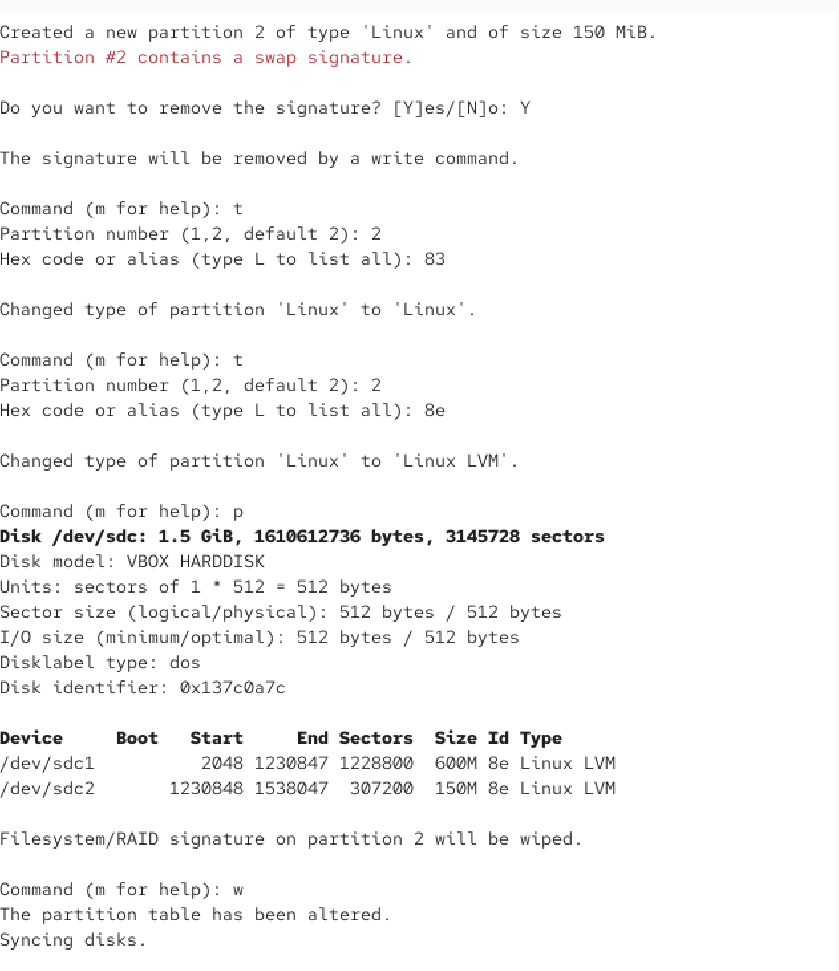{ width=50% }

*Рис. 14 — Создание /dev/sdc2*

\newpage

# Выводы по проделанной работе

## Вывод

Были освоены процедуры работы с LVM:
создание PV, VG, LV, монтирование, расширение и уменьшение томов.
Отработаны навыки управления файловыми системами ext4 и XFS.