# Цели и задачи работы

## Цель лабораторной работы

Освоить создание, настройку и администрирование RAID-массивов при помощи утилиты mdadm в Linux.

\newpage

# Процесс выполнения лабораторной работы

## Проверка дисков

-

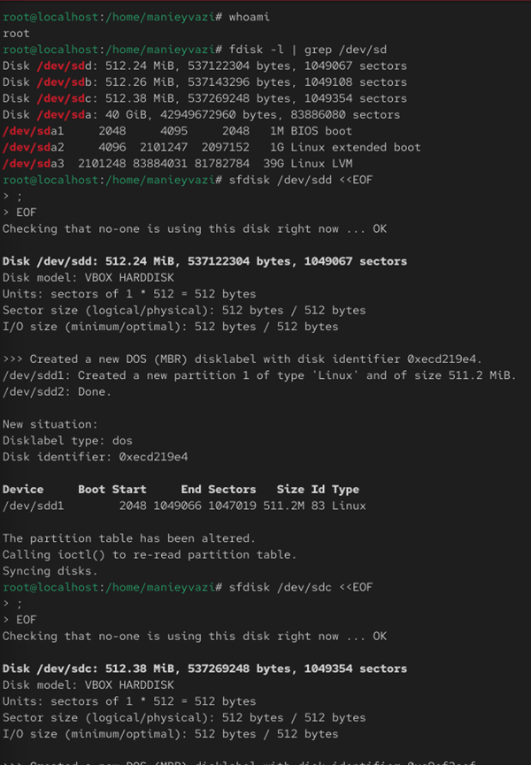{ width=40% }

*Рис. 1 — Проверка дисков*

\newpage

## Создание разделов

-.

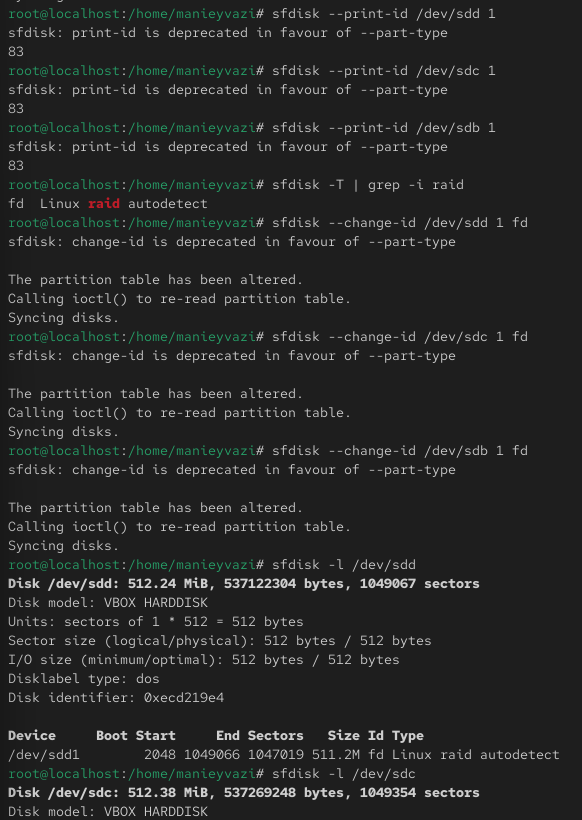{ width=40% }

*Рис. 2 — Типы разделов и изменение типа на RAID*

\newpage

## Разделы типа RAID

-

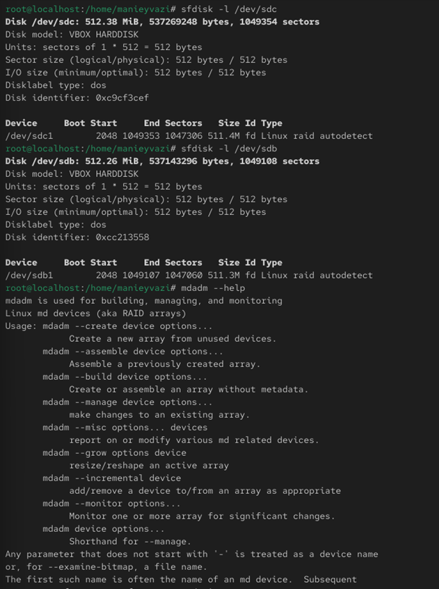{ width=40% }

*Рис. 3 — Разделы типа fd (Linux raid autodetect)*

\newpage

## Создание RAID1
-.

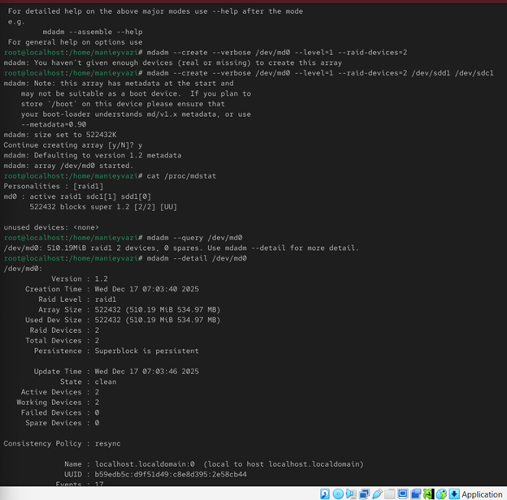{ width=60% }

*Рис. 4 — Создание RAID1*

\newpage

## Детальная информация массива

-.

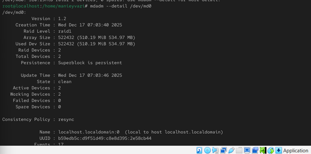{ width=85% }

*Рис. 5 — Информация о RAID1*

\newpage

## Файловая система и монтирование

-.

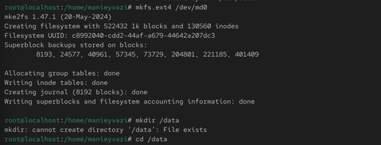{ width=85% }

*Рис. 6 — Создание ext4 и монтирование*

\newpage

## Автомонтирование

-.

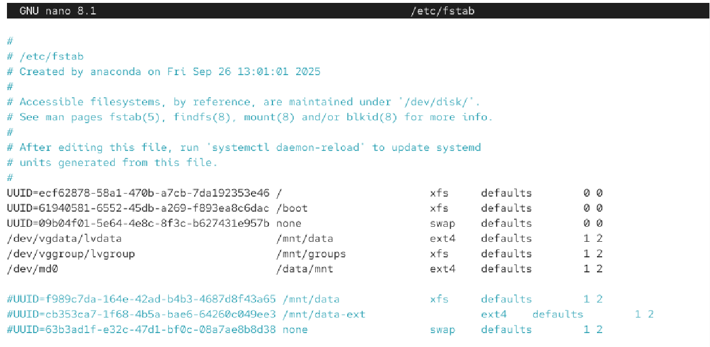{ width=85% }

*Рис. 7 — fstab запись*

\newpage

## Сбой одного диска

-.

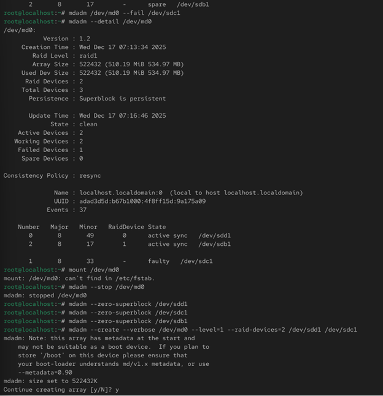{ width=55% }

*Рис. 8 — Сбой и удаление устройства*

\newpage

## Завершение работы массива

Проверка работы системы.

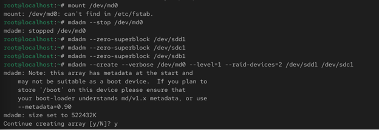{ width=85% }

*Рис. 9 — Остановка и очистка суперблоков*

\newpage

## Создание массива и добавление hot spare

-

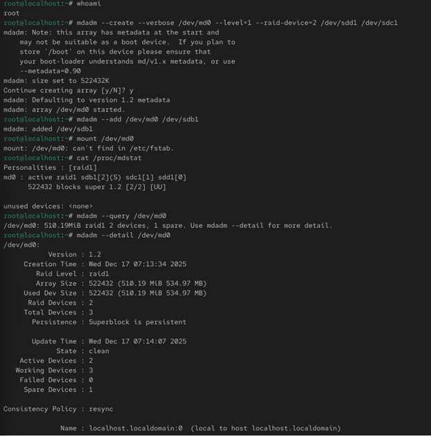{ width=55% }

*Рис. 10 — Hot spare добавлен*

\newpage

## Состояние массива с резервом

-

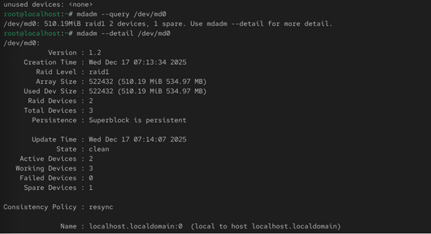{ width=85% }

*Рис. 11 — Состояние RAID с hotspare*

\newpage

## Сбой устройства

-

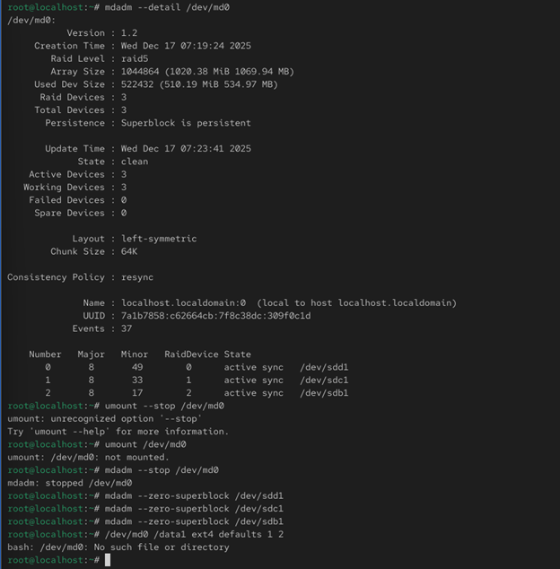{ width=55% }

*Рис. 12 — Активация резервного диска*

\newpage

## Исходный RAID1 перед конвертацией

-

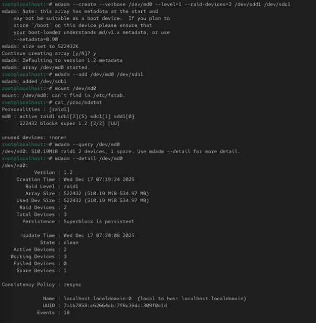{ width=55% }

*Рис. 13 — Перед преобразованием*

\newpage

## Состояние массива

-

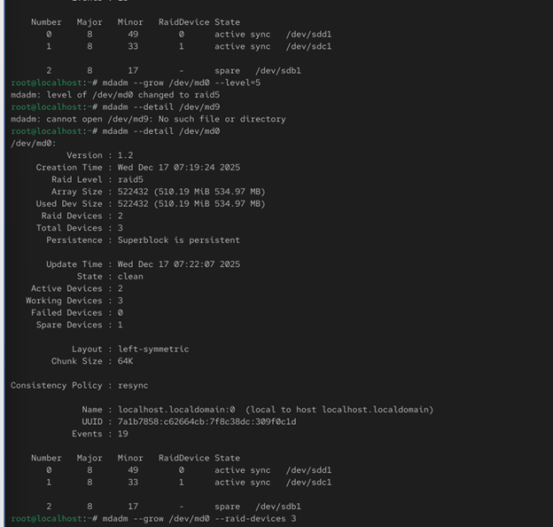{ width=55% }

*Рис. 14 — Состояние RAID перед изменением*

\newpage

## Изменение уровня массива

-

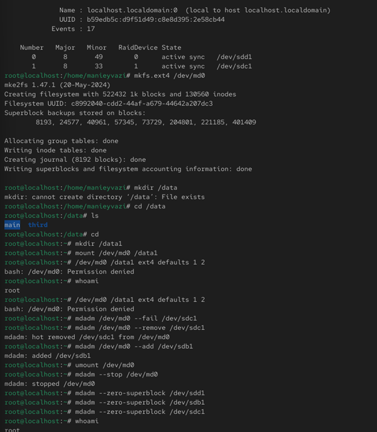{ width=55% }

*Рис. 15 — Преобразование в RAID5*

\newpage

## Финальная конфигурация RAID5

-

{ width=55% }

*Рис. 16 — Итоговый RAID5*

\newpage

# Выводы по проделанной работе

## Вывод

В ходе работы были изучены принципы создания и администрирования RAID-массивов в Linux.
Созданы и протестированы конфигурации RAID 1, RAID 1 с hot spare, а также выполнено преобразование массива RAID 1 в RAID 5 и расширение его состава.